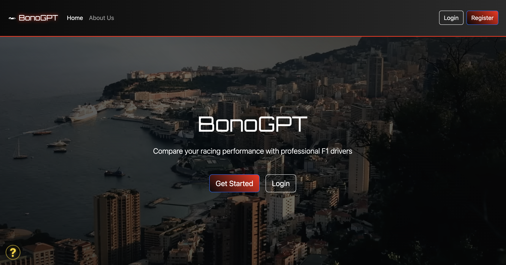
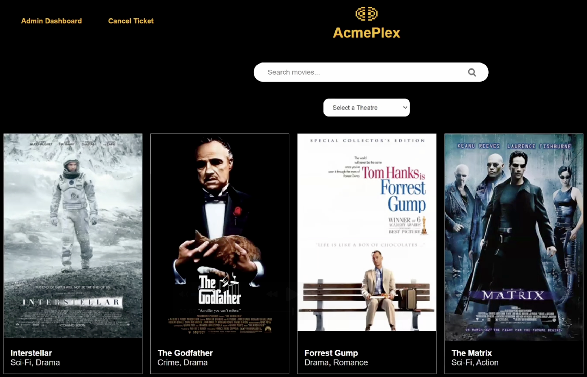
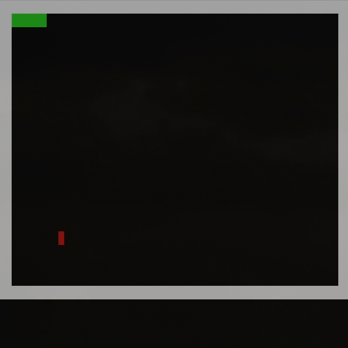

## 👋 Hey There!

I’m a **third-year Software Engineering student at the University of Calgary** with a deep passion in all things software, from machine learning and graphics to full-stack web development.

---

## 🛠️ Tech Stack
**Languages:**

**Frameworks & Libraries:**

**DevOps Tools:**

---

## ⚙️ My Work
<table align="center">

  <tr>
  <td align="center" valign="middle" style="padding-top: 50px;">
    
  </td>
  <td align="center">
    
  </td>
  </tr>

  <tr>
  <td align="center">
    
  </td>
  <td align="center">
    
  </td>
  </tr>

</table>

